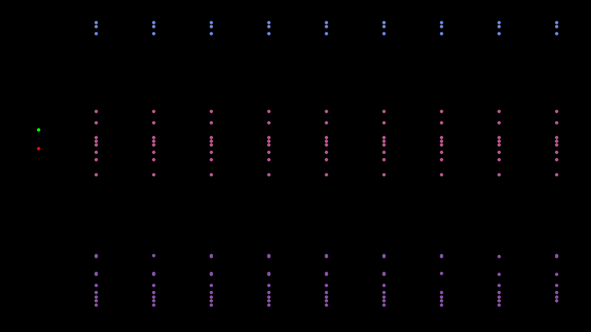
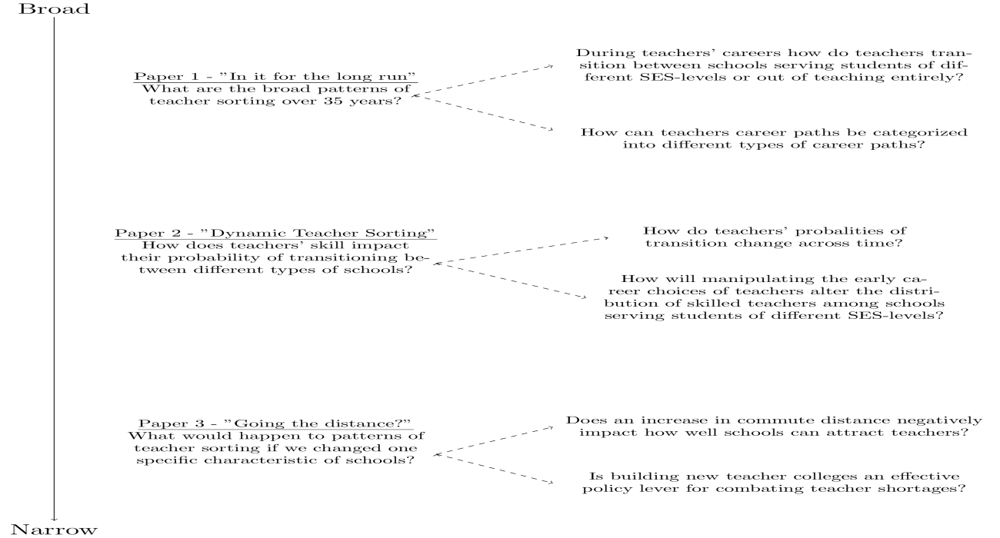
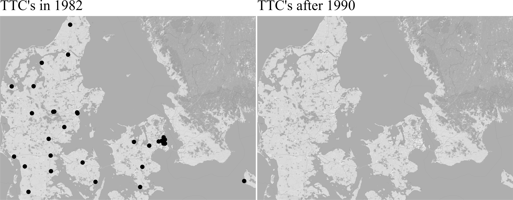

```{css, echo = FALSE}
caption {
      font-size: 1.0em;
    }
    
p.caption {
  font-size: 0.6em;
}

.remark-slide-content.full-slide-fig{
  padding: 0px 0px 0px 0px;
  width: 100%;}
  
.title-slide {
  color: #000000;
   background-image:url(vive_noback_2.jpg),url(ku_logo_uk_hh.png), url(anim_1.gif);
  background-position:2% 98% ,2% 2%, 100% 0%;
  background-size: 200px,200px,600px;
  background-color: #000000;
  padding-left: 0px,0px;  /* delete this for 4:3 aspect ratio */
}

.title-slide h1 {
  color:               white;
  text-shadow: none;
   padding-right: 500px;

}

.title-slide h2 {
  color:               white;
  text-shadow: none;
   padding-right: 500px;

}

.title-slide h3 {
  color:               white;
  text-shadow: none;
   padding-right: 500px;

}


.center2 {
  margin: 0;
  position: absolute;
  top: 50%;
  left: 50%;
  -ms-transform: translate(-50%, -50%);
  transform: translate(-50%, -50%);
}

.remark-slide-content.full-slide-fig{
  padding: 0px 0px 0px 0px;
  width: 100%;}


.left-column2 {
  width: 50%;
  float: right;
  padding-top: 1em;
}

.right-column2 {
  width: 50%;
  float: right;
  padding-top: 1em;
}
    
    
```


```{r setup, echo = FALSE, warning = FALSE, message=FALSE}


options(htmltools.dir.version = FALSE)

knitr::opts_chunk$set(echo = FALSE, warning = FALSE, message=FALSE, dev = "png", dev.args = list(type = "cairo-png"),
                      out.height="480px")

#knitr::opts_chunk$set(echo = FALSE, warning = FALSE, message=FALSE, dev = "svglite")


library(ggmap)
library(RCurl)

library(httr)
library(jsonlite)
library(plyr)
library(patchwork)
library(gridExtra)
library(geosphere)
library(scales)
library(kableExtra)
library(purrr)
library(rgdal)
library(plotly)
library(reshape2)
library(knitr)
library(magick)
library(ggh4x)


#ggplot theme

theme_set(theme_minimal(base_size = 16,base_family = "serif")+ theme(axis.line = element_line(color='black'),
    plot.background = element_blank(),
    panel.grid.major = element_blank(),
    panel.grid.minor = element_blank(),
    panel.border = element_blank()))


#for rendering latex tables. Straight from https://stackoverflow.com/a/38632805


tex2markdown <- function(texstring) {
  writeLines(text = texstring,
             con = myfile <- tempfile(fileext = ".tex"))
  texfile <- pandoc(input = myfile, format = "html")
  cat(readLines(texfile), sep = "\n")
  unlink(c(myfile, texfile))
}

xaringanExtra::use_freezeframe()


```

---

# What is teacher sorting and why is it important?


--

.center2[

Lets imagine the following scenario

]

---

# Two types of teachers


```{r two-tch}

knitr::include_graphics("C:\\Users\\b059064\\Desktop\\PHD\\papers\\full dissertation\\defence\\two_teach_plot.png")

```


---

#Two types of teachers and three types of schools


```{r two-tch-schl-1}

knitr::include_graphics("C:\\Users\\b059064\\Desktop\\PHD\\papers\\full dissertation\\defence\\tch_schl_plot_1.png")

```


---

#Two types of teachers and three types of schools


```{r two-tch-schl-2}

knitr::include_graphics("C:\\Users\\b059064\\Desktop\\PHD\\papers\\full dissertation\\defence\\tch_schl_plot_2.png")

```


---

#Two types of teachers and three types of schools


```{r two-tch-schl-3}

knitr::include_graphics("C:\\Users\\b059064\\Desktop\\PHD\\papers\\full dissertation\\defence\\tch_schl_plot_3.png")

```


---

# Teachers go to work

```{r two-tch-dyn}

#


```

---

<!--  -->

<!-- <center> -->
<!--  -->
<!-- </center> -->

<video width="1300" height="550" autoplay>
  <source src="two_tch_dyn_res.mp4" type="video/mp4">
  Your browser does not support the video tag.
</video>

---


# Let's try that with alot of teachers

And let's do a race!

--

Which kind of school ends up with the most skilled teachers?

---

# What happens if nothing matters?


```{r load-bar-rand}

# new_gif_bar <- image_read("C:\\Users\\b059064\\Desktop\\PHD\\papers\\full dissertation\\defence\\race_bar_rand.gif")
# 
# new_gif_bar

```

<!--  -->

<!-- <center> -->
<!--  -->
<!-- </center> -->

---

<!-- <iframe width="1000" height="500" src="race_bar_rand.mp4" frameborder="0" allow="accelerometer; autoplay; encrypted-media; gyroscope; picture-in-picture" allowfullscreen></iframe> -->

<video width="1300" height="550" autoplay>
  <source src="race_bar_rand.mp4" type="video/mp4">
  Your browser does not support the video tag.
</video>


---

# what happens if teachers' skill and school characteristics matter?

```{r load-bar-model}

# new_gif_bar_model <- magick::image_read("C:\\Users\\b059064\\Desktop\\PHD\\papers\\full dissertation\\defence\\race_bar_model.gif")
# 
# new_gif_bar_model

```

<!--  -->

<!-- <center> -->
<!--  -->
<!-- </center> -->

---

<video width="1300" height="550" autoplay>
  <source src="race_bar_model.mp4" type="video/mp4">
  Your browser does not support the video tag.
</video>


---


# How does teacher sorting impact educational inequality?

```{r diff-frame}

df_func_model <- read.csv("C:\\Users\\b059064\\Desktop\\PHD\\papers\\full dissertation\\sim_data_model.csv")

df_func_rand <- read.csv("C:\\Users\\b059064\\Desktop\\PHD\\papers\\full dissertation\\sim_data_rand.csv")
# 
# df_func_model$school_prop_qual_2 <- ave(df_func_model$qual, list(df_func_model$period, df_func_model$school_id, df_func_model$sim),
#                                       FUN=function(x){
#                                         
#                                         table(x)[2]
#                                       })
# 
# df_func_model$n_teacher <- ave(df_func_model$teacher_id, ave(df_func_model$period, df_func_model$school_id, df_func_model$sim),
#                                       FUN=function(x){
#                                         
#                                         length(unique(x))
#                                       })
# 
# 
# 
# df_func_model <- df_func_model %>% 
#  group_by(period,school_id,sim) %>%
#   mutate(n = length(unique(teacher_id)))
# 
# df_func_model <- df_func_model %>% 
#  group_by(period,school_id,sim, qual) %>%
#   mutate(n_qual = length(unique(teacher_id)))
# 
# df_func_model$school_prop_qual <- df_func_model$n_qual/df_func_model$n
# 
# df_func_model$school_prop_qual_2 <- ifelse(df_func_model$qual==-2, 1-df_func_model$school_prop_qual, df_func_model$school_prop_qual)
# 
# ggplot(df_func_model, aes(school_prop_qual_2, stud_perf, color=schools))+geom_smooth()
# 
# aggregate(df_func_model$school_prop_qual_2, list(df_func_model$schools, df_func_model$period), mean)
# 
# aggregate(df_func_model$stud_perf, list(df_func_model$schools, df_func_model$period), median)
# 
# aggregate(df_func_model$stud_perf, list(df_func_model$schools, df_func_model$period), sd)
# 
# 
# 
# df_func_rand <- df_func_rand %>% 
#  group_by(period,school_id,sim) %>%
#   mutate(n = length(unique(teacher_id)))
# 
# df_func_rand <- df_func_rand %>% 
#  group_by(period,school_id,sim, qual) %>%
#   mutate(n_qual = length(unique(teacher_id)))
# 
# df_func_rand$school_prop_qual <- df_func_rand$n_qual/df_func_rand$n
# 
# df_func_rand$school_prop_qual_2 <- ifelse(df_func_rand$qual==-2, 1-df_func_rand$school_prop_qual, df_func_rand$school_prop_qual)
# 
# ggplot(df_func_rand, aes(school_prop_qual_2, stud_perf, color=schools))+geom_smooth()
# 
# aggregate(df_func_rand$school_prop_qual_2, list(df_func_rand$schools, df_func_rand$period), mean)
# 
# 
# aggregate(df_func_rand$stud_perf, list(df_func_rand$schools, df_func_rand$period), mean)
# 
# df_func_rand$prop_cat <- df_func_rand$school_prop_qual_2>quantile(df_func_rand$school_prop_qual_2)[4]
# 
# df_func_rand$prop_cat <- dplyr::ntile(df_func_rand$school_prop_qual_2,4)
# 
# df_func_rand$prop_cat <- cut(df_func_rand$school_prop_qual_2, breaks=c(0,.1,.2,.4,.6,.7,1),
#                              include.lowest = TRUE)
# 
# prop.table(table(df_func_rand$prop_cat))
# 
# aggregate(df_func_rand$stud_perf, list(df_func_rand$schools, df_func_rand$prop_cat, df_func_rand$period), mean)
# 
# 
# library(ggridges)
# 
# ggplot(df_func_rand, aes(x=stud_perf, y=as.factor(period), fill=schools))+geom_density_ridges()
# 
#   
#   
# unique(df_func_model$school_prop_qual[df_func_model$school_id==20&df_func_model$sim==80&df_func_model$period==2])[2]
# 
# 
# prop.table(table(df_func_model$qual[df_func_model$school_id==10&df_func_model$sim==1],
#                  df_func_model$period[df_func_model$school_id==10&df_func_model$sim==1]), margin=2)
# 
# length(unique(df_func_model$teacher_id[df_func_model$school_id==20&df_func_model$sim==80&df_func_model$period==2]))

diff_frame <- aggregate(df_func_model$stud_perf, list(df_func_model$schools, df_func_model$period, df_func_model$sim), mean)

diff_frame <- data.table::dcast(Group.2+Group.3~Group.1, value.var = "x", data=diff_frame)

diff_frame$diff <- diff_frame$`Public 75_100`-diff_frame$`Public 0_25`

diff_frame_model <- diff_frame


diff_frame <- aggregate(df_func_rand$stud_perf, list(df_func_rand$schools, df_func_rand$period, df_func_rand$sim), mean)

diff_frame <- data.table::dcast(Group.2+Group.3~Group.1, value.var = "x", data=diff_frame)

diff_frame$diff <- diff_frame$`Public 75_100`-diff_frame$`Public 0_25`

diff_frame_rand <- diff_frame


diff_frame_rand$scenario <- "No sorting"

diff_frame_model$scenario <- "Teacher sorting"

diff_frame_all <- rbind(diff_frame_rand, diff_frame_model)


```


We need two pieces of information

1) The gap in academic performance between the bottom 25% and the upper 25% on an index of socio-economic status(SES) is 0.9 standard deviations, or about 3 years of learning(Hanushek, 2022)

2) The difference in growth of academic performance between an averagely skilled teacher and a highly skilled teacher is about 0.2 standard deviations(Jackson,2014)


```{r ses-gap-calc}

#z-score of 25th perc
z <- qnorm(.25)

#z-score if academic achievement improved by 0.9 sd

z_2 <- z+0.9

#percentile after improvement
p_improv <- pnorm(z_2)


```

---

# How does teacher sorting impact educational inequality?

.right-column[

```{r gap-plot-base, fig.width=18}

diff_frame_all <- read.csv("C:\\Users\\b059064\\Desktop\\PHD\\papers\\mantle\\diff_frame_mantle.csv")


 ggplot(diff_frame_all, aes(Group.2, diff, color=scenario))+geom_point(alpha=0)+ylim(.8,1)+geom_hline(yintercept = .9, linetype="dashed")+labs(x="Years since graduation", y="SES gap in academic performance")+scale_x_continuous(breaks = seq(0, 10, by = 1))+theme(axis.title = element_text(size=16),axis.text.x = element_text(size=16),
    axis.text.y = element_text(size=16),legend.text = element_text(size=16),
    legend.title = element_text(size=16))+scale_alpha_identity()+
  theme(legend.text = element_text(color="white"), legend.title = element_text(color="white"))

```

]


---

# How does teacher sorting impact educational inequality?

.left-column[

- Teacher sorting worsens educational inequality!

]

.right-column[


```{r gap-plot, fig.width=18}

 ggplot(diff_frame_all, aes(Group.2, diff, color=scenario))+geom_smooth()+ylim(.8,1)+geom_hline(yintercept = .9, linetype="dashed")+labs(x="Years since graduation", y="SES gap in academic performance")+scale_x_continuous(breaks = seq(0, 10, by = 1))+theme(axis.title = element_text(size=16),axis.text.x = element_text(size=16),
    axis.text.y = element_text(size=16),legend.text = element_text(size=16),
    legend.title = element_text(size=16))

```


]

???

This is the main motivation for this dissertation! We were hoping that schools could alleviate educational inequality
but if teacher sorting persists, schools will end up worsening educational inequality!

---


# What do we know already, and what don't we know?

- The literature generally shows that teachers are unequally distributed across schools

- Both teacher and schools traits impact how teachers are distributed across schools

Several school characteristics are associated with higher attrition among teachers

- Higher school poverty level Allen et al., 2018; Smith and Ingersoll, 2007), school
level achievement(Hanushek et al., 2015; Ingersoll and May, 2012)

- Lower school level achievement(Hanushek et al., 2015; Ingersoll and May, 2012)

- Higher proportions of ethnic minority pupils(Allen et al., 2018; Carroll et al., 2000; Falch and Strøm, 2004; Feng, 2014; Hanushek et al., 2015; Shen, 1997)

- Higher proportions of ethnic minority pupils(Allen et al., 2018; Carroll et al., 2000; Falch and Strøm, 2004; Feng, 2014; Hanushek et al., 2015; Shen, 1997)

- Higher shares of inexperienced teachers, discipline problems, and inadequate support from the
administration(Ingersoll, 2007a; Shen, 1997)

---

# What do we know already, and what don't we know?

## However

- Most of what we know derives from studies in the US.

- Most studies do not identify causal effects(and if they do, most concern financial factors, e.g. salary)


???

WE don't know alot about teacher sorting outside the US, so we don't know much about how e.g. institutional context moderates teacher sorting


---

# overview of papers


```{r papers-fig, out.height="525px"}

#knitr::include_graphics("C:\\Users\\b059064\\Desktop\\PHD\\papers\\mantle\\papers_complement_fig.pdf")

# library(magick)

# papers_fig <- image_scale(image_read_pdf("C:\\Users\\b059064\\Desktop\\PHD\\papers\\mantle\\papers_complement_fig.pdf",
#                        pages = 1), "!1300X700")
# 
# papers_fig <- image_read_pdf("C:\\Users\\b059064\\Desktop\\PHD\\papers\\mantle\\papers_complement_fig.pdf",
#                        pages = 1)
# 
# image_write(papers_fig, "C:\\Users\\b059064\\Desktop\\PHD\\papers\\full dissertation\\defence\\papers_complement_fig.png")




```

<!-- {width=70%} -->


<!--  -->

<!-- <embed src="papers_complement_fig.pdf" type="application/pdf", width="700" height="500"> -->

---

# Paper 1 - Introduction

- Most studies investigate short term transitions between different types of schools or transitions out of teaching

- A focus on career paths can better inform whether timing of sorting is e.g. early or late career or if transitions out of teaching are definitive or if some teachers return to teaching

--

In this paper i investigate

1) How do teacher career choices, across teachers' career, fall within different types of schools or opting out of teaching

2) How can the overall distribution of teacher career paths be segmented into distinct types of career paths?

3) How are teacher characteristics, such as credentials and demographics, associated with these career paths?

---

# Paper 1 - data & mehtods

### Data

- Danish administrative data covering 1980 to 2020: 
  - All primary school teachers
  - Students and their parents in primary school 
  - Teachers and students linked at the school level
  

### Methods

- sequence analysis

- Schools are categorized into 4 types of schools, based on the SES composition of students at schools

- Use cluster analysis to segment teacher careers into different types of career


---

# Paper 1 - Results

So many not in public primary schools!! 

```{r overall-seq-plot, fig.cap="overall distribution of sequences", fig.width=18, fig.height=5, dpi=300, out.height="400px"}

# knitr::include_graphics("C:\\Users\\b059064\\Desktop\\PHD\\papers\\teacher career paths\\results_from_dst\\Transfer_708877_300624\\results\\seq_plot_overall.png")

plot_dat <- read.table("C:\\Users\\b059064\\Desktop\\PHD\\papers\\teacher career paths\\results_from_dst\\Transfer_708877_140824\\seqdplot_dat.txt", sep=",")

ggplot(plot_dat, aes(x=x, y=value, fill=state, group=state))+geom_bar(stat="identity", color="black")+labs(y="proportion", x="Years since graduation")

```

---
# Paper 1 - Results

4 types of career paths


```{r cluster-seq-plot, fig.cap="distribution of sequences across clusters", fig.width=18, fig.height=5, dpi=300, out.height="400px"}

# knitr::include_graphics("C:\\Users\\b059064\\Desktop\\PHD\\papers\\teacher career paths\\results_from_dst\\Transfer_708877_300624\\results\\seq_plot_clusters.png")


plot_dat <- read.table("C:\\Users\\b059064\\Desktop\\PHD\\papers\\teacher career paths\\results_from_dst\\Transfer_708877_140824\\seqdplot_clust_dat.txt", sep=",")

plot_dat$n_group <- as.numeric(stringr::str_extract(plot_dat$grouplab, "\\d{4}"))

plot_dat$sum <- sum(unique(plot_dat$n_group))

plot_dat$perc <- round(plot_dat$n_group/plot_dat$sum,2)

plot_dat$grouplab_new <- gsub("\\d{4}", plot_dat$perc, plot_dat$grouplab)

plot_dat$grouplab_new <- stringi::stri_replace_all_regex(plot_dat$grouplab, "n=\\d{4}", paste("share=",plot_dat$perc))

plot_dat$grouplab_new <- gsub("Cluster 1", "Cluster 1 - Leavers ", plot_dat$grouplab_new)

plot_dat$grouplab_new <- gsub("Cluster 2", "Cluster 2 - Teaching the marginalized ", plot_dat$grouplab_new)

plot_dat$grouplab_new <- gsub("Cluster 3", "Cluster 3 - Teaching the affluent ", plot_dat$grouplab_new)

plot_dat$grouplab_new <- gsub("Cluster 4", "Cluster 4 - All-round teachers ", plot_dat$grouplab_new)


plot_dat$state <- factor(plot_dat$state, levels=c("0-25%", ">25%-50%", ">50%-75%", ">75%-100%", "Not teacher"))


ggplot(plot_dat, aes(x=x, y=value, fill=state, group=state))+geom_bar(stat="identity", color="black")+facet_wrap(~grouplab_new)+labs(x="Years since graduation", y="Proportion")


```


---

# Paper 1 - Results

## Can teacher characteristics predict the type of career path?

Teacher characteristics are very poor predictors of the type of career path


```{r varimp}

varimp <- read.table("C:\\Users\\b059064\\Desktop\\PHD\\papers\\teacher career paths\\results_from_dst\\Transfer_708877_140824\\varimp_pdp.txt", sep=",")

varimp$varimp <- varimp$varimp*100

names(varimp) <- c("Variable", "Importance")

varimp$Variable <- as.factor(varimp$Variable)

levels(varimp$Variable) <- c("Age at graduation", "Number of children in household", "Marital status", "Teacher high-school GPA", "Gender", "Municipality type","Year of graduation")

knitr::kable(varimp, digits=2,  caption = "Importance of teacher characteristics")

# pdp_files <- list.files("C:\\Users\\b059064\\Desktop\\PHD\\papers\\teacher career paths\\results_from_dst\\Transfer_708877_140824", pattern = "pdp_", full.names = TRUE)
# 
# pdp_files <- pdp_files[-grep("inter", pdp_files)]
# 
# pdp_plots <- lapply(pdp_files, function(x){
#   
#   x <- pdp_files[3]
#   
#   pdp_dat <- read.table(x, sep=",")
# 
# 
# lab <- unique(pdp_dat$var_name)
# 
# if (lab=="muni_type") {
#   
#   pdp_dat$var <- as.factor(pdp_dat$var)
#   
#   levels(pdp_dat$var) <- c("Capital", "Metropolitan", "Province", "Suburban", "Rural")
#   
# }
# 
# lab <- ifelse(lab=="age_at_grad", "age at graduation", 
#        ifelse(lab=="KARAKTER_UDD_HS", "Teacher high-school GPA",
#               ifelse(lab=="muni_type", "Municipality type", lab)))
# 
# 
# 
# })


```


---

# Paper 1 - Conclusion

- Teachers mainly "stay in their lane", i.e. employment at one type of school is not much more prevalent in some stages of teachers' careers than in others.

- More than half of teacher graduates are not working in public primary schools!

- The overall pattern of teacher career paths can be divided into 4 different types of teacher career paths

- Teacher characteristics offer very little predictive power in terms of predicting which types of career paths teachers choose.

- EXTRA: sequences of first 10 years across cohorts


---

.center2[

Would be nice to look at transitions one by one, instead of entire sequence...

]


---

# Paper 2 - Introduction


- In contrast to paper 1, the main goal to model, rather than describe, how teachers transition between different types of employment. 

- We model the career choices of teachers using a structural dynamic modelling approach. 

---

# Paper 2 - Data

- We use danish administrative data on all teacher graduates in the years 2008-2022 and link these to workplaces on a bi-annual basis. Workplaces are linked to schools 


- We use teachers college GPA as indication of teachers' skill.


- We divide the occupational choices of teachers into 7 categories: 
    - Public primary schools serving students in the lower 25% of the distribution of parental education
    - Public primary schools serving students in the 25-75% of the distribution of parental education
    - Public primary schools serving students in the upper 25% of the distribution of parental education
    - Private primary schools
    - Other Teaching
    - Not Teacher
    - Out


---

# Paper 2 - Results


- Some of the main results you have seen already

--

- Our model suggests that teachers with higher college GPA are more likely to work in schools serving students in which parents have the 25% longest educations, and vice versa for teachers with lower college GPA

--

- However, descriptive results are interesting as well

---

# Paper 2 - Results

- Patterns in data clearly show that teachers, with different levels of GPA, sort between schools 

- Teachers are sorted already from the beginning!

```{r sort-perc-public, fig.width=20, fig.height=12, out.width="100%", out.height="450px"}


#write.table(p_dat, "C:\\Users\\b059064\\Desktop\\PHD\\papers\\dynamic sorting\\descriptive results\\plot_sorting_public_exp.txt", sep=",")

p_dat <- read.csv("C:\\Users\\b059064\\Desktop\\PHD\\papers\\dynamic sorting\\descriptive results\\plot_sorting_public_exp.txt")


p_dat$facet <- as.factor(p_dat$facet )

levels(p_dat$facet ) <- c("Public 0-25%", "Public 25-75%", "Public 75-100%")


#names(p_dat)[grep("PANEL", names(p_dat))] <- "facet"

p_dat$linetype <- ifelse(p_dat$linetype=="22","At or below median", "Above median")

p_dat$linetype <- as.factor(p_dat$linetype)

p_dat$linetype <- relevel(p_dat$linetype, ref="At or below median")


p <- ggplot(p_dat, aes(x, y, group=group, color=linetype, linetype=linetype))
#p <- p+geom_line()
p <- p+stat_smooth(se=FALSE, size=1.5)
#p <- p+geom_vline(xintercept=index_per, linetype="dashed")
p <- p+facet_wrap(~facet, labeller=label_wrap_gen(10))
#p <- p+stat_smooth(data=test[as.numeric(as.character(test$period))>1,c("shares", "status", "period")], se=FALSE, color="red", linetype="dashed")
p3 <- p+theme(axis.text.x = element_text(vjust=.5, size=18), strip.text.y.right = element_text(angle=0),
             legend.position = "bottom")
#p3 <- p+ggtitle("percentage of teachers with a given status type\nacross periods after graduation by college GPA quantiles")
p3 <- p3+labs(x="periods after graduation",
              y="Share within schooltype", color="Teacher GPA", linetype="Teacher GPA")
  
#p
p3


```

---

# Paper 2 - Results

- What if teachers were obligated to work in public primary schools in the first 2 years after graduation?

- This has a permanent impact on subsequent choices, but improvement is lowest in the low SES public school and "out" group grows


```{r sim-dist, fig.width=20, fig.height=12, out.width="100%", out.height="400px"}

tab <- read.csv("C:\\Users\\b059064\\Desktop\\PHD\\papers\\dynamic sorting\\model results tables\\diff_tab_alt_sim1.txt", sep=",")

tab$Var2 <- gsub("_([0-9]{1,})", "-\\1%", tab$Var2 )


ggplot(tab, aes(Var1, Freq, color=sim, linetype=sim))+geom_line(se=FALSE)+facet_wrap2(~Var2, axes = "all")+geom_vline(xintercept=4, linetype="dashed")+labs(y="percent", x="period", color="")+scale_color_manual(name="", labels=c("baseline", "simulated"), values=c("red", "#00B8E7"))+scale_linetype_manual(name="", labels=c("baseline", "simulated"), values=c("solid", "dashed"))+
  theme(legend.position = c(0.7,0.1), axis.title.x = element_text(hjust=.1))

```


??? 

One of the cool things with structural models is that we get to simulate counterfactual scenarios and play Robert Frost

---

# Paper 2 - Do teachers look for higher wages?

- Teachers switching to _any_ job outside public primary schools experience a substantial _decrease_ in wages, more than 37% for low-GPA teacher graduates.

- This suggests that teachers switch to occupations outside public primary schools due to other factors, e.g. working conditions


```{r wage-sim, fig.width=22, fig.height=12, out.height="400px", out.width="1600px"}


type_frame <- expand.grid(gpa_type=c("high", "low"), not_teacher_shift=c("yes", "no"), female_type=c("yes", "no"))


nper <- 29

dfs <- lapply(1:nrow(type_frame), function(x){
  
  #x <- 1
  
  
  df <- data.frame(period=1:nper, gpa=0, female=1, post_reform=0, works_part_time=0, unemp_rate=3, 
                   not_teacher=0, pub_school_mid=1, exp_not_teach=0, exp_pub=0)
  
  df$gpa <- ifelse(type_frame[x,"gpa_type"]=="high", 1, -1)
  
   if (type_frame[x,"not_teacher_shift"]=="yes") {
    
    df$not_teacher[10:nrow(df)] <- 1
    
    df$pub_school_mid[10:nrow(df)] <- 0
    
  } 
  
  
  df$female <- ifelse(type_frame[x,"female_type"]=="yes",1,0)
  
  df$exp_not_teach <- cumsum(df$not_teacher)
  
  df$exp_pub <- cumsum(df$pub_school_mid)
  
  df$gpa_not_teach_int <- df$gpa*df$not_teacher
  
  df$intercept <- 1
  
  df <- cbind(df, type_frame[x,])
  
  return(df)
  
  
})


dfs <- do.call("rbind", dfs)

tab <- read.csv("C:\\Users\\b059064\\Desktop\\PHD\\papers\\dynamic sorting\\model results tables\\model_table_wage.txt", sep=" ")

names(tab) <- "Parameter estimate"

tab$`Parameter estimate` <- gsub("\\(.*?\\)", "", tab$`Parameter estimate`)

tab$`Parameter estimate` <- gsub("\\n", "", tab$`Parameter estimate`)

tab$`Parameter estimate` <- gsub("\\*", "", tab$`Parameter estimate`)

tab$`Parameter estimate` <- as.numeric(tab$`Parameter estimate`)

names <- rownames(tab)[c(1,2,3,4,5,6,10,14,16,19,23)]

tab <- tab[c(1,2,3,4,5,6,10,14,16,19,23),]

names(tab) <- names


#df$pred_wage <- as.matrix(df[2:12])%*%tab

dfs$pred_wage <- as.matrix(dfs[2:12])%*%tab

dfs$pred_wage <- exp(dfs$pred_wage)/7.45


dfs$gpa_type <- paste(dfs$gpa_type, "college GPA")

dfs$not_teacher_shift <- ifelse(dfs$not_teacher_shift=="yes", "Transitions to occupation\noutside teaching", 
                                "Does not transition to occupation\noutside teaching")

dfs$comb_lab <- paste(dfs$not_teacher_shift, ",", dfs$gpa_type)


ggplot(dfs[dfs$female_type=="no",], aes(period, pred_wage, color=comb_lab, linetype=comb_lab, size=comb_lab))+
  geom_line()+labs(y="Gross monthly income in Euros", color="Teacher type", linetype="Teacher type")+theme(legend.key.size = unit(2.0, 'cm'))+ guides(color = guide_legend(byrow = TRUE))+
  scale_linetype_manual(values=c("dashed", "solid", "dotted", "twodash"), name="Teacher type")+scale_size_manual(values=c(.75,.75,2,.75), name="Teacher type")


```


---

# Paper 2 - Conclusion

- Teachers sort between schools in way that favors schools with high-SES students

- "Mandatory service" in public primary schools doesn't seem promising

- Teachers leave public primary schools due to working conditions

---

```{r set up TTC data, include=FALSE}

dir <- "C:\\Users\\b059064\\Desktop\\PHD\\conferences and presentations\\Rockwool brown bag 2024"


#setwd("C:\\Users\\B059064\\Desktop\\PHD\\conferences and presentations\\CEN 2023")

sogn_travel_dist <- read.table(file.path(dir, "tables\\sogn_travel_dist.txt"),sep=",",check.names=FALSE)


ps <- read.table(file.path(dir, "tables\\des_stats_covars.txt"),sep=",",check.names=FALSE)

ps_tchrs <- read.table(file.path(dir, "tables\\des_stats_tchrs.txt"), check.names=FALSE, sep=",")


ps_studs <- read.table(file.path(dir, "tables\\des_stats_studs.txt"),sep=",",check.names=FALSE)


res_df <- read.table(file.path(dir, "tables\\DID_commute.txt"),sep=",",check.names=FALSE)


did_estimaes_df_tchrs_red <- read.table(file.path(dir, "tables\\did_estimaes_tchrs.txt"),sep=",",check.names=FALSE)


did_estimaes_df_studs_red <- read.table(file.path(dir, "tables\\did_estimaes_studs.txt"),sep=",",check.names=FALSE)


effs <- read.table(file.path(dir, "tables\\effect_sizes_thresholds.txt"),sep=",",check.names=FALSE)


effs_studs <- read.table(file.path(dir, "tables\\effect_sizes_thresholds_studs.txt"),sep=",",check.names=FALSE)


# alt_estimators_tchrs <- readRDS("alt_estimators_tchrs.rds")

did_estimaes_df_tchrs <- read.table(file.path(dir, "tables\\did_estimaes_tchrs_full.txt"),sep=",",check.names=FALSE)


# alt_estimators_studs <- readRDS("alt_estimators_studs.rds")

did_estimaes_df_studs <- read.table(file.path(dir, "tables\\did_estimaes_studs_full.txt"),sep=",",check.names=FALSE)

dist_thresh_dfs <- read.table("C:\\Users\\B059064\\Desktop\\PHD\\papers\\TTC dif in dif\\PHD_dissertation\\from_DST_results\\results_5-3-2024\\tables\\att_across_dist_thresholds_tchrs.txt", sep=",", check.names=FALSE)


bsadid_df_all_comb_mean_tchrs <- read.table("C:\\Users\\B059064\\Desktop\\PHD\\papers\\TTC dif in dif\\PHD_dissertation\\from_DST_results\\results_5-3-2024\\tables\\att_cohort_tchrs.txt", sep=",",check.names=FALSE)


access_df_agg <- read.table(file.path(dir, "tables\\tchr_access_df.txt"),sep=",",check.names=FALSE)


access_df_agg_2 <- read.table(file.path(dir, "tables\\tchr_access_df_cohort.txt"),sep=",",check.names=FALSE)


access_df_agg_2$dif <- access_df_agg_2$tcrh_access - access_df_agg_2$tchr_access_year


# 
# 
# 
# df <- read.table("tables\\number_grads_by_ttc.txt",sep=",",check.names=FALSE)
# 
# 
# df_2 <- read.table("tables\\number_teachers_by_experXschool_reduced.txt",sep=",",check.names=FALSE)
# 


# bsadid_df_all_comb_mean_tchrs <- read.table("tables\\att_cohort_tchrs.txt", sep=",",check.names=FALSE)
# 
# bsadid_df_all_comb_mean_studs <- read.table("tables\\att_cohort_studs.txt", sep=",",check.names=FALSE)


alt_estimators_df_tchrs <- read.table(file.path(dir, "tables\\alt_estimators_tchrs.txt"), sep=",", 
                                      check.names = FALSE)

alt_estimators_cohort_df_tchrs <- read.table(file.path(dir, "tables\\alt_estimators_cohorts_tchrs.txt"), sep=",", check.names = FALSE)

alt_estimators_df_studs <- read.table(file.path(dir, "tables\\alt_estimators_studs.txt"), sep=",", 
                                      check.names = FALSE)

alt_estimators_cohort_df_studs <- read.table(file.path(dir, "tables\\alt_estimators_cohort_studs.txt"), sep=",", check.names = FALSE)


dist_thresh_dfs <- read.table(file.path(dir, "tables\\att_across_dist_thresholds_tchrs.txt"), sep=",", check.names=FALSE)

dist_thresh_dfs_stud <- read.table(file.path(dir, "tables\\att_across_dist_thresholds_studs.txt"), sep=",", check.names=FALSE)

outcomes_list_tchrs <- c("avg_age", "avg_seniority", "tchr_pupil_ratio", "teacher_ed_share_new", "avg_hs_GPA", "avg_hs_GPA_young", "avg_year_since_grad", "newgrad_teacher_share")

outcomes_list_studs <- c("avg_hs_GPA_students", "pria_5", "pria_10", "pria_20", "secondedcomp_5", "secondedcomp_10", "secondedcomp_20", "collegecomp_10", "collegecomp_15", "collegecomp_20")


#load TTC data------

#only run these lines if you haven't gotten the geodata for the TTC's yet

# ttc.info <- read.csv("TTC_info.csv",sep=";", encoding = "latin1")
# 
# #Query Google Maps API for TTC coordinates----
# 
# 
# 
# 
# 
# ##get geodata loop-------
# 
# geodata.dfs <- lapply(1:nrow(ttc.info), function(x) {
#   
# cat(paste("processing row nr.", x, "\r"))  #progress indicator
#   
#   ID <- x
# 
# #format address for the API query  
#   
# address <- trimws(gsub(" ", "%20", ttc.info$adresse[x])) #insert %20 instead of white space
# 
# address <- gsub("\n", "", address) #get rid of line breaks
# 
# #construct API query
# 
# query <- paste("https://nominatim.openstreetmap.org/search/", address, "?format=json&polygon=1&addressdetails=1", sep="")
# 
# #query API
# 
# coords <- httr::GET(query)
# 
# #we get a json response, but it's in binary code, so we'll reformat using the "content" function from "httr"
# 
# json<-content(coords,as="text") 
# 
# #and finally we can get our dataframe for the wuery in question
# 
# geodata <- fromJSON(json)
# 
# #The dataframe has a couple of problematic columns that we'll need to deal with, since we need
# #to rbind all the dataframes which we get from the loop
# 
# 
# #firstly the "address" column is a dataframe, so well make that into a separate datafram and cbind it to out main dataframe
# addr.df <- geodata$address
# 
# geodata <- cbind(geodata[,-ncol(geodata)], addr.df)
# 
# #the column "boundingbox" is a list. Since we don't really need this column, we'll just remove it from the dataframe
# 
# ind <- which(names(geodata) %in% "boundingbox")
# 
# geodata <- geodata[,-ind]
# 
# geodata$ttc_id <- ID
# 
# return(geodata)
# 
# })
# 
# 
# 
# geodata.full <- do.call("rbind.fill", geodata.dfs)
# 
# #remove duplicates
# 
# geodata.full <- geodata.full[!duplicated(geodata.full[,"ttc_id"]),]
# 
# 
# geodata.full <- cbind(geodata.full, ttc.info)
# 
# geodata.full$år.nedlagt[is.na(geodata.full$år.nedlagt)] <- 9999
# 
#write.csv(geodata.full, file="geodata_TTC.csv")

geodata.full <- read.csv("C:\\Users\\B059064\\Desktop\\PHD\\papers\\TTC dif in dif\\PHD_dissertation\\geodata_TTC.csv", fileEncoding="latin1")

names(geodata.full)[grep("Ã.r.nedlagt$", names(geodata.full))] <- "year_closed"


schools.info <- read.csv("C:\\Users\\B059064\\Desktop\\PHD\\papers\\TTC dif in dif\\PHD_dissertation\\folkeskoledata_all_corrected.csv")


#compute distance between schools and TTC's--------


schools.info$GEO_BREDDE_GRAD <- as.numeric(gsub(",", ".", schools.info$GEO_BREDDE_GRAD))

schools.info$GEO_LAENGDE_GRAD <- as.numeric(gsub(",", ".", schools.info$GEO_LAENGDE_GRAD))

shp <- readOGR(dsn = "C:\\Users\\B059064\\Desktop\\PHD\\papers\\TTC dif in dif\\PHD_dissertation\\DK_shp\\DNK_adm0.shp", 
               stringsAsFactors = F)


```


# Paper 3 - Introduction


- In this paper i investigate what happens when *commute distance* increases for teachers, _specifically newly graduated teachers_.

## Research questions

- How does the impact of decreasing school attractiveness impact schools’ ability to attract newly graduated teachers?

- How does the impact of decreasing school attractiveness impact schools’ ability to attract newly graduated
skilled teachers?


---

# Paper 3 - Is commute distance important?


- Commute distance’s impact on teacher attraction has been overlooked compared to other
factors like student body composition. 

- increasing commute distance from 0 to 6 miles leads to a 19% increase in the probability of
transferring to a different school(Boyd et al., 2005a).

- living within a distance of 1 mile from an average urban school, with poor working conditions, still preferable to working at an average suburban school located at least 21 miles away.(Boyd et al., 2012).

- 10 minutes commute equivalent to a reduction in yearly salary of 530$(Johnston, 2020).

---

## Why commute distance?

- Can help to reveal causes of geographical patterns of inequality in teacher shortages and geographical patterns of inequality in studentachievement, e.g., the rural/urban-gap in student achievement(Young, 1998; Zhang et al., 2018)

- Feasible, but expensive, policy lever.

???

Other things might be effective, but not very feasible. E.g. raising average educational level of an area.

---

# Paper 3 - Methods

- I investigate a "natural experiment" in which over 33% of danish teacher training colleges(TTC's) closed

- This meant that some schools experienced an increase in the distance to the nearest TTC


```{r get map}


#need to make bounding box to circumvent Google API usage https://stackoverflow.com/a/56456046
#bounding box works on 
bbox <- make_bbox(as.numeric(geodata.full$lon), as.numeric(geodata.full$lat), f=.05)


#only run you don't already have the map in the folder, or you want to get a new map 

# map <- get_stamenmap(bbox = bbox, zoom = 10, maptype = c("terrain"),
#                      crop = TRUE, messaging = FALSE, urlonly = FALSE,
#                      color = c("bw"), force = FALSE)
# 
# 
# 
# save(map, file="map_TTC.Rdata")

load(file="C:\\Users\\B059064\\Desktop\\PHD\\papers\\TTC dif in dif\\PHD_dissertation\\map_TTC.Rdata")


```


```{r TTC-plot, fig.width=20, fig.height=28, include=FALSE}

map.before <- ggmap(map)+geom_point(aes(x = as.numeric(lon), y = as.numeric(lat)), data = geodata.full, size = 5)+
  ggtitle("TTC's in 1982")+theme(axis.line = element_blank(), axis.text.x=element_blank(),
                                     axis.title.x = element_blank(),  axis.text.y=element_blank(),
                                     axis.title.y = element_blank(), axis.ticks = element_blank(),
                                     plot.title=element_text(size=40),
                                 plot.margin=unit(c(-1.30,0,0,0), "null"))


#geodata.full$color <- ifelse(geodata.full$år.nedlagt<1990,"red", "black")

map.after <- ggmap(map)+geom_point(aes(x = as.numeric(lon), y = as.numeric(lat)), 
                                   data = geodata.full[geodata.full$år.nedlagt>1990,], size = 5)+
  ggtitle("TTC's after 1990")+theme(axis.line = element_blank(), axis.text.x=element_blank(),
                                    axis.title.x = element_blank(),  axis.text.y=element_blank(),
                                    axis.title.y = element_blank(), axis.ticks = element_blank(),
                                    plot.title=element_text(size=40), plot.caption = element_text(size=25),
                                    plot.margin=unit(c(-1.30,0,0,0), "null"))

#map.before+map.after

#map.before

#grid.arrange(map.before,map.after,nrow=1)

#map.before/map.after+plot_layout(widths = unit(c(45), units = c("cm")))

p <- map.before+map.after

ggsave('TTC_maps.png', p)


knitr::plot_crop("TTC_maps.png", quiet = TRUE)


p <- ggplot() + geom_polygon(data = shp, aes(x = long, y = lat, group = group), colour = "black", fill = NA)


geodata.full_long <- purrr::map_dfr(unique(geodata.full$year_closed), function(x){
  
  
  
  x <- ifelse(x>3000, 2020,x)
  
  #geo_df <- geodata.full[geodata.full$year_closed>x,]
  
  geo_df <- geodata.full
  
  geo_df$closed <- ifelse(geodata.full$year_closed>x, "black", "red")
  
  geo_df$subset <- x
  
  return(geo_df)
  
})


```


```{r facet-map, fig.width=18, fig.height=12, out.height="400px", out.width="1200px", dpi=300}


map.before <- p+geom_point(aes(x = as.numeric(lon), y = as.numeric(lat), color=geodata.full_long[geodata.full_long$subset<2008,"closed"]), data = geodata.full_long[geodata.full_long$subset<2008,],
                           size = 2.5,
                           )+
  ggtitle("Overview of closure of TCs")+theme(axis.line = element_blank(), axis.text.x=element_blank(),
                                     axis.title.x = element_blank(),  axis.text.y=element_blank(),
                                     axis.title.y = element_blank(), axis.ticks = element_blank())
map.before <- map.before+facet_wrap(~subset)
map.before <- map.before+scale_color_manual(values=c("black", "red"), labels=c("open", "closed"))+
  theme(legend.position = "bottom", legend.title = element_blank())

map.before


```


```{r map-plot, fig.cap="Geographic distribution of TTC's across Denmark"}

#


```

---

# Paper 3 - The closure of TTCs


```{r distfigures, fig.width=15, fig.height=8, out.height="500px", out.width="1200px", dpi=600}

# par(oma = c(0, 0, 0, 0))
# 
# par(mar = c(0, 0, 0, 0))
# 
# 
# knitr::include_graphics("impact-dist.png")

mat.schools <- distm(schools.info[,c("GEO_LAENGDE_GRAD", "GEO_BREDDE_GRAD")], geodata.full[,c("lon", "lat")], fun=distVincentyEllipsoid)

# write.csv(mat.schools, "C:\\Users\\B059064\\Desktop\\PHD\\conferences and presentations\\afdelingsseminar 2024\\mat_schools_all.csv")

#mat.schools <- read.csv("mat_schools_all.csv")
 
 dists.before.schools <- apply(mat.schools, 1, FUN = function(x) {min(x[x > 0])}) #from https://stackoverflow.com/a/10718322
 
 
mat.schools <- distm(schools.info[,c("GEO_LAENGDE_GRAD", "GEO_BREDDE_GRAD")], geodata.full[geodata.full$year_closed>1990,c("lon", "lat")], fun=distVincentyEllipsoid)

# 
# 
# write.csv(mat.schools, "C:\\Users\\B059064\\Desktop\\PHD\\conferences and presentations\\afdelingsseminar 2024\\mat_schools_after.csv")

#mat.schools <- read.csv("mat_schools_after.csv")


dists.after.schools <- apply(mat.schools, 1, FUN = function(x) {min(x[x > 0])}) #from https://stackoverflow.com/a/10718322

 

dist.frames <- lapply(sort(as.numeric(unique(geodata.full$year_closed)))[1:(length(unique(geodata.full$year_closed))-1)], function(x){

   #cat(paste("processing year", x))

   mat.schools <- distm(schools.info[,c("GEO_LAENGDE_GRAD", "GEO_BREDDE_GRAD")], geodata.full[geodata.full$year_closed>x,c("lon", "lat")], fun=distVincentyEllipsoid)


   dists.after.schools <- as.data.frame(apply(mat.schools, 1, FUN = function(x) {min(x[x > 0])})) #from https://stackoverflow.com/a/10718322

   names(dists.after.schools) <- paste("dist after", x)

   return(dists.after.schools)


 })

 dist.frames.all <- do.call("cbind", dist.frames)

# write.csv(dist.frames.all, "C:\\Users\\B059064\\Desktop\\PHD\\conferences and presentations\\afdelingsseminar 2024\\dist_frame_all.csv")
# 
#  dist.frames.all_2 <- read.csv("dist_frame_all.csv")
 

 dist.dif.frame <- apply(dist.frames.all,2,function(x){
   
   x- dists.before.schools
   
 })
 
 #dist.dif.frame <- do.call("cbind", dist.dif.frame)
 
 names(dist.dif.frame) <- names(dist.frames.all)
 
 schools.info$disttottc_before <- dists.before.schools
 
 schools.info$disttottc_after <- dists.after.schools
 
 schools.info$disttottcdiff <- schools.info$disttottc_after-schools.info$disttottc_before
 
 
 dist.df <- rbind(data.frame(dist=dists.before.schools, before_after="before closures"), 
                  data.frame(dist=dists.after.schools, before_after="after closures"))
 
 schools.info.red <- cbind(schools.info[c("INST_NR","GEO_LAENGDE_GRAD", "GEO_BREDDE_GRAD")], dist.dif.frame)
 
 schools.info.red.long <- reshape2::melt(schools.info.red, id.vars=c("INST_NR","GEO_LAENGDE_GRAD", "GEO_BREDDE_GRAD"))
 
 schools.info.red.long$year <- as.numeric(gsub(".*? ([0-9][0-9][0-9][0-9])", "\\1",schools.info.red.long$variable))

# gg <-  ggmap(map)+geom_point(aes(x = GEO_LAENGDE_GRAD, y = GEO_BREDDE_GRAD, color=value), 
#                              data = schools.info.red.long[schools.info.red.long$year<1990,], size = 1) + 
#   scale_color_gradientn(colours = c("black","blue","red"), 
#                         values = rescale(c(0,1000,40000)),
#                         guide = "colorbar", limits=c(0,40000))+
#   facet_wrap(~year)+
#   theme(axis.line = element_blank(), axis.text.x=element_blank(),
#         axis.title.x = element_blank(),  axis.text.y=element_blank(),
#         axis.title.y = element_blank(), axis.ticks = element_blank(), 
#         plot.margin=grid::unit(c(0,0,0,0), "mm"),
#         plot.caption = element_text(size=7, family="serif"), 
#         legend.title = element_text(size=7, family="serif"),
#         legend.text = element_text(size=7, family="serif"))+
#   labs(caption = "schools that experienced a change in distance\nto nearest TTC >= 1000 meters are colored black",
#        color="distance in\nmeters")
# gg


#with shp instead

gg <-  p+geom_point(aes(x = GEO_LAENGDE_GRAD, y = GEO_BREDDE_GRAD, color=value), 
                             data = schools.info.red.long[schools.info.red.long$year<1990,], size = 1) + 
  scale_color_gradientn(colours = c("black","blue","red"), 
                        values = rescale(c(0,1000,40000)),
                        guide = "colorbar", limits=c(0,40000))+
  facet_wrap(~year)+
  theme(axis.line = element_blank(), axis.text.x=element_blank(),
        axis.title.x = element_blank(),  axis.text.y=element_blank(),
        axis.title.y = element_blank(), axis.ticks = element_blank(), 
        plot.margin=grid::unit(c(0,0,0,0), "mm"),
        plot.caption = element_text(size=7, family="serif"), 
        legend.title = element_text(size=9, family="serif"),
        legend.text = element_text(size=9, family="serif"))+
  labs(caption = "schools that experienced a change in distance\nto nearest TTC >= 1000 meters are colored black",
       color="distance in\nmeters")+
  theme(legend.position = "bottom", legend.key.width = unit(3, "cm"))+ggtitle("Increase in distance to nearest TC of each school\nfollowing closure of TCs")
gg


```

---


# paper 3 - Hypothesis

Where do teachers live before, during and after studying?

A hypothetical example

```{r hypo-anim}


# schools.info <- read.csv("C:\\Users\\B059064\\Desktop\\PHD\\papers\\TTC dif in dif\\PHD_dissertation\\folkeskoledata_all_corrected.csv")


# geodata.full <- read.csv("C:\\Users\\B059064\\Desktop\\PHD\\papers\\TTC dif in dif\\PHD_dissertation\\geodata_TTC.csv")
# 
# geodata_full_samp <- geodata.full[sample(1:nrow(geodata.full), 5),]

pattern <- "Frederiksberg|Haderslev Seminarium|Esbjerg|Odense|Silkeborg"


geodata_full_samp <- geodata.full[grep(pattern, geodata.full$Seminarium),]


#names(geodata.full)[grep("Ã.r.nedlagt$", names(geodata.full))] <- "year_closed"


ttc_radius_df <- purrr::map_dfr(1:nrow(geodata_full_samp), function(x){
  
  
  point <- sf::st_point(c(geodata_full_samp$lat[x], geodata_full_samp$lon[x]))
  
  point <- sf::st_sfc(point, crs="+proj=longlat +datum=WGS84 +no_defs")
  
  buf_round <- sf::st_buffer(point, dist = 20000)
  
  buf_round <-as.data.frame(sf::st_coordinates(buf_round))
  
  buf_round$ttc <- x
  
  return(buf_round)
  

  
  
})


#compute distance between schools and TTC's--------


# schools.info$GEO_BREDDE_GRAD <- as.numeric(gsub(",", ".", schools.info$GEO_BREDDE_GRAD))
# 
# schools.info$GEO_LAENGDE_GRAD <- as.numeric(gsub(",", ".", schools.info$GEO_LAENGDE_GRAD))

set.seed(43920)

schools.info_samp <- schools.info[sample(1:nrow(schools.info), 20),]

tch_df <- data.frame(tch_id=1:200, lat=0, lon=0)

# tch_df$lon <- rnorm(200,mean(c(shp@bbox[1],shp@bbox[3])))
#                     
# 
# tch_df$lat <- rnorm(200,mean(c(shp@bbox[2],shp@bbox[4])))


#simply take coordinates from school coordinates, to avoid teachers randomluy landing in the sea


set.seed(43920)


tch_df[c("lat", "lon")] <- schools.info[sample(1:nrow(schools.info),200, replace=TRUE),
                                             c("GEO_BREDDE_GRAD", "GEO_LAENGDE_GRAD")]


lat_lon_pert <- purrr::map_dfr(1:max(ttc_radius_df$ttc), function(x){
  
  
  lat_lon_pert <-  schools.info[which((schools.info$GEO_BREDDE_GRAD<=max(ttc_radius_df$X[ttc_radius_df$ttc==x])&
                        schools.info$GEO_BREDDE_GRAD>=min(ttc_radius_df$X[ttc_radius_df$ttc==x]))&
                          (schools.info$GEO_LAENGDE_GRAD<=max(ttc_radius_df$Y[ttc_radius_df$ttc==x])&
                       schools.info$GEO_LAENGDE_GRAD>=min(ttc_radius_df$Y[ttc_radius_df$ttc==x]))
                       ),
               c("GEO_BREDDE_GRAD", "GEO_LAENGDE_GRAD")]
  
})

set.seed(43920)

tch_df$time <- "before studying"

tch_df_2 <- tch_df

tch_df_2[c("lat", "lon")] <- lat_lon_pert[sample(1:nrow(lat_lon_pert), 200, replace=TRUE),]

tch_df_2$time <- "while studying"

tch_df <- rbind(tch_df, tch_df_2)


dist_mat <- distm(schools.info_samp[,c("GEO_LAENGDE_GRAD", "GEO_BREDDE_GRAD")], 
                  tch_df[tch_df$time=="while studying", c("lon", "lat")], fun=distVincentyEllipsoid)

#which schools is closest to each teacher?

school_ind <- apply(dist_mat,2,which.min)


tch_df_3 <- cbind(tch_df_2$tch_id, schools.info_samp[school_ind,c("GEO_BREDDE_GRAD", "GEO_LAENGDE_GRAD")], tch_df_2$time)

names(tch_df_3) <- names(tch_df)

tch_df_3$time <- "after graduation"

tch_df <- rbind(tch_df, tch_df_3)


#make plot

p <- ggplot() + geom_polygon(data = shp, aes(x = long, y = lat, group = group), colour = "black", fill = NA)


p <- p+geom_text(data=geodata_full_samp, aes(x=lon, y=lat), inherit.aes = FALSE, size=10, label="\U1F3DB",
                 family = "Arial Unicode MS")


p_base <- p+geom_text(data=schools.info_samp, aes(x=GEO_LAENGDE_GRAD, y=GEO_BREDDE_GRAD), 
                 inherit.aes = FALSE, size=5, label="\U1F3EB", family = "Arial Unicode MS")

#p_base

tch_df$time <- paste(rep(1:3, each=200), tch_df$time)


tch_df$size <- rep(c(4,6,8), each=200)

p <- p_base+geom_text(data=tch_df, aes(x=lon, y=lat, frame=time), size=3, label="\UC6C3", 
                        family = "Arial Unicode MS", position=position_jitter(width=.2,height=.2))

anim <- ggplotly(p, width=900, height=525)%>% 
  animation_opts(
    frame = 1000,
    transition = 1000,
    easing = "linear",
    redraw = FALSE,
    mode = "immediate"
  )


htmltools::save_html(anim, file="hypo_anim.html") 

#cat(plotly:::plotly_iframe(anim))

#anim


```


---

<iframe src="hypo_anim.html" width="1000" height="600" scrolling="no" seamless="seamless" frameBorder="0"> </iframe>

<!-- <iframe src="hypo_anim.html" width="1200" height="1000" scrolling="yes" seamless="seamless" frameBorder="0" style="width:100%; height:100%;" allowfullscreen> </iframe> -->


???

Increase in distance to nearest TC --> Increase in distance to where newly graduated teachers live --> Newly graduated teachers have to commute longer --> More difficult to attract newly graduated teachers

Schools that experience an *increase in distance to nearest TC* following the closure of TCs are considered as *treated schools*


---

# Paper 3 - Results

## Impact on commute distance

- Minimum requirement, did teachers really start to commute longer to affected schools?

--


```{r commute-dist-to-schl}

#write.csv(res_df, "tables\\DID_commute.csv")

res_df$estimate <- gsub("\\(", "\n\\(", res_df$estimate)

res_df$estimate <- gsub(";", " ; ", res_df$estimate)

names(res_df)[1] <- "variable"


kab <- knitr::kable(res_df, digits = 2, booktabs = T, caption = "<span style='font-size:12px'>Estimated ATT of TTC closures on the commute distance of all teachers and newly graduated teachers. Confidence intervals for the estimates are shown in parenthesis</span>")


# save table data


kab <- kableExtra::kable_styling(kab, full_width = FALSE, latex_options = "hold_position")%>% column_spec(1:ncol(res_df), width = "7cm")


#
#
# plot_noctrl <- ggdid(bsadid_mean)
#
# ggdid(bsadid)


# parish is missing for everyone in 1980, meaning that the INST-parish distance
# cannot be computed for anyone in 1980. This makes the preprocessing in "staggered"
# drop all observations, since it drops any units that do not have complete observations in
# all periods. Since the preprocessing has no problem detecting all 28 periods, it will
# thus drop any units that do not have complete observations in all 28 periods, which
# in the case of "inst_parish_dist" is everyone. As such we'll need to only run the model
# a subset of the data that does not include any observations in 1980.

# schools_info_long$year_treated_4 <- ifelse(schools_info_long$year_treated_3<1980, Inf, schools_info_long$year_treated_3)
#
#
#
# stag_did <- staggered::staggered(df = schools_info_long[schools_info_long$year>1980,],
#                                  i = "INST_NR_comb",
#                                  t = "year",
#                                  g = "year_treated_4",
#                                  y = "inst_parish_dist",
#                                  estimand = "cohort")
#
#
# stag_did_young <- staggered::staggered(df = schools_info_long[schools_info_long$year>1980,],
#                                  i = "INST_NR_comb",
#                                  t = "year",
#                                  g = "year_treated_4",
#                                  y = "inst_parish_dist_young",
#                                  estimand = "cohort")
#
# stag_did_df <- rbind(stag_did, stag_did_young)
#
# stag_did_df$ci <- paste(round(stag_did_df$estimate-1.96*stag_did_df$se,2),";",round(stag_did_df$estimate+1.96*stag_did_df$se,2))
#
# stag_did_df <- cbind(c("average commute distance", "average commute distance for newly graduated teachers"), stag_did_df)
#
# names(stag_did_df) <- c("", "estimate", "SE", "SE Neyman", "CI")
#
# kab <- knitr::kable(stag_did_df, digits=2)
#
# #event study specification
#
# stag_did_event <- staggered::staggered(df = schools_info_long[schools_info_long$year>1980,],
#                                  i = "INST_NR_comb",
#                                  t = "year",
#                                  g = "year_treated_4",
#                                  y = "inst_parish_dist",
#                                  estimand = "eventstudy",
#                                  eventTime=-10:20)
#
# stag_did_event_young <- staggered::staggered(df = schools_info_long[schools_info_long$year>1980,],
#                                  i = "INST_NR_comb",
#                                  t = "year",
#                                  g = "year_treated_4",
#                                  y = "inst_parish_dist_young",
#                                  estimand = "eventstudy",
#                                  eventTime=-10:20)
#
# stag_did_event$var <- "average commute distance"
#
# stag_did_event_young$var <- "average commute distance\nfor newly graduated teachers"
#
# stag_did_event_all <- rbind(stag_did_event, stag_did_event_young)
#
# stag_did_event_all$event <- ifelse(stag_did_event_all$eventTime>-1,"TTC closed", "TTC still open")
#
#
```


They did!!


```{r did-commute-tab}

kab <- kableExtra::kable_styling(kab, position = "left")

kab


# quantile(schools_info_long$inst_parish_dist[schools_info_long$treated_dyn==FALSE], na.rm=TRUE)
```

---


# Paper 3 - Impact on teacher body composition


```{r restab}

# round(did_estimaes_df_tchrs[did_estimaes_df_tchrs$outcome=="avg_hs_GPA","est"],2)
# 
# round(did_estimaes_df_tchrs[did_estimaes_df_tchrs$outcome=="tchr_pupil_ratio","lower"],3)

#write.csv(did_estimaes_df_tchrs_red, "C:\\Users\\B059064\\Desktop\\PHD\\papers\\TTC dif in dif\\PHD_dissertation\\from_DST_results\\tables\\did_estimaes_tchrs.csv")

outcomes <- c("Average seniority", "Student/teacher ratio", "Share of newly hired teachers with teacher certification",
              "Average years since graduation","Average high school GPA of newly graduated teachers", 
              "Share of newly graduated teachers")

did_estimaes_df_tchrs_red <- did_estimaes_df_tchrs_red[did_estimaes_df_tchrs_red$Outcome %in% outcomes,]


kab <- knitr::kable(did_estimaes_df_tchrs_red[c("Outcome", "n", "Estimate", "Effect size for unadjusted estimate")], booktabs = T, caption = "Estimated ATT of closure of TTCs on teacher composition outcomes. Lower and upper bounds of confidence intervals are in parenthesis", row.names=FALSE, col.names = c("Outcome", "n", "Estimate", "Effect size"))

# save table data


kab <- kableExtra::kable_styling(kab, full_width = FALSE, latex_options=c("scale_down", "HOLD_position"), font_size = 14 )%>% column_spec(1:ncol(did_estimaes_df_tchrs_red[c("Outcome", "n", "Estimate", "Effect size for unadjusted estimate")]) ,width = "3cm")


kab
```


---


<!-- # Results -->

<!-- Impact on student academic performance -->


```{r restab-students, eval=FALSE}

#write.csv(did_estimaes_df_studs_red, "tables\\did_estimaes_studs.csv")


kab <- knitr::kable(did_estimaes_df_studs_red, booktabs = T, caption = "Estimated ATT of closure of TTCs on outcomes pertaining to student academic performance and attainment. Lower and upper bounds of confidence intervals are in parenthesis")

# save table data


kab <- kableExtra::kable_styling(kab, full_width = FALSE, latex_options=c("scale_down", "hold_position"), font_size = 11.5)

kab <- column_spec(kab, 1, width = "12cm")

kab <- column_spec(kab, 2:ncol(ps_studs), width = "1.5cm")


kab
```

---

# Paper 3 - Why no effect?

 - Did teachers commute the same distance as before closures of TTCs?
 
 - Did newly graduated teachers still live as close to TTCs as before closures of TTCs?
 
---

NO and NO

```{r dist-exper-cor, fig.cap = "commute distance and distance from residence across years since graduation. Red line represents distance from residence to TTC while black line represent commute distance. Dashed lines represent the average across the pretreatment period 1980-1985", out.height="550px"}


#setwd("C:\\Users\\B059064\\Desktop\\PHD\\conferences and presentations\\CEN 2023")


knitr::include_graphics(file.path(dir, "figures\\dist-exper-cor.png"))
```


<!-- # Why no effect? -->

<!--  Did teachers commute the same distance as before, and did newly graduated teachers still live close to TTCs? -->


```{r job-search-radius-plot, fig.cap = "Average job search radius across years since graduation. Job search radius=distance from residence to TTC+commute distance", out.height="400px", eval=FALSE}


knitr::include_graphics(file.path(dir, "figures\\job-search-radius-plot.png"))
                        
                        
```


---

# Paper 3 - conclusion

- Results show that commute distance likely has a lower impact on school attractiveness than theory and empirical results suggest.

- Teachers, and especially newly graduated teachers, are seemingly more willing to commute than anticipated.

- While building new TTCs is a feasible policy lever, it is costly and likely an ineffective way of addressing inequality 
in distribution of teachers.


---


# Discussion - What is a good teacher? 

- Is GPA a good measure of teacher quality?

- Evidence is somewhat mixed

- However, teachers' experience is consistently one of the best predictors of teacher effectiveness(Bacher-Hicks&Koedel, 2023; Coenen et al, 2018)

- We might look at results from Coenen et al, 2018, a systematic review on the association between teacher characteristics and teacher effectiveness.

- we may compare the _association between teachers' college level academic achievement(e.g. licensure test scores, GPA etc.) and teacher effectiveness_ to the _association between teacher experience and teacher effectiveness_. 


---


```{r vam-gpa-lit, echo=FALSE, include=FALSE}

vam_gpa_tab <- read.csv("C:\\Users\\b059064\\Desktop\\PHD\\papers\\full dissertation\\defence\\vam_gpa_tab.csv", sep=";")

names(vam_gpa_tab) <- gsub("\\.", "_", names(vam_gpa_tab))

vam_gpa_tab <- vam_gpa_tab[-grep("relation", names(vam_gpa_tab) )]


vam_gpa_tab_long_subj <- reshape2::melt(vam_gpa_tab, id.vars=c("Tables_Study", "Tables_Level", "Tables_Туре", "Tables_Type_of_test"),
                                   measure.vars = paste("subject", 1:4, sep="_"))


vam_gpa_tab_long_eff <- reshape2::melt(vam_gpa_tab, id.vars=c("Tables_Study", "Tables_Level", "Tables_Туре", "Tables_Type_of_test"),
                                   measure.vars = paste("effect", 1:4, sep="_"))

names(vam_gpa_tab_long_eff)[ncol(vam_gpa_tab_long_eff)] <- "eff"

vam_gpa_tab_long_subj <- cbind(vam_gpa_tab_long_subj, vam_gpa_tab_long_eff[c("eff")])

vam_gpa_tab_long_subj$value <- tolower(vam_gpa_tab_long_subj$value )

vam_gpa_tab_long_subj$value <-  ifelse(!vam_gpa_tab_long_subj$value %in% c("math", "reading"), "other subjects", vam_gpa_tab_long_subj$value )

vam_gpa_tab_long_subj$alpha <- ifelse(vam_gpa_tab_long_subj$eff==0, 0,1)

vam_gpa_tab_long_subj$eff_2 <- ifelse(vam_gpa_tab_long_subj$eff==0, "NS",vam_gpa_tab_long_subj$eff)


vam_gpa_tab_long_subj <- vam_gpa_tab_long_subj[order(vam_gpa_tab_long_subj$value, -vam_gpa_tab_long_subj$eff),]


vam_gpa_tab_long_subj$mean_eff <- ave(vam_gpa_tab_long_subj$eff, list(vam_gpa_tab_long_subj$value), FUN=function(x){
  
  x <- x[x!=0]
  
  mean(x, na.rm=TRUE)
})

library (kableExtra)

# vam_gpa_tab_long_subj <- vam_gpa_tab_long_subj[!is.na(vam_gpa_tab_long_subj$eff)&!vam_gpa_tab_long_subj$value=="other subjects",
#                              c("value", "Tables_Study", "eff_2", "mean_eff")]

vam_gpa_tab_long_subj <- vam_gpa_tab_long_subj[!is.na(vam_gpa_tab_long_subj$eff),
                             c("value", "Tables_Study", "eff_2", "mean_eff")]


names(vam_gpa_tab_long_subj) <- c("Subject", "Study", "Effect size", "Avg. effect")


 
 vec <- vam_gpa_tab_long_subj %>% 
   filter(Subject!="other subjects") %>% 
   select(Subject)
 
row <-  min(which(vec=="reading"))-1
   
   

 gpa_kab <- kable(vam_gpa_tab_long_subj[vam_gpa_tab_long_subj$Subject!="other subjects",], row.names = FALSE, digits=2, caption="Association between teacher licensure test scores and teacher effectiveness",
                  booktabs=TRUE) %>%
   kable_classic(full_width = F, html_font = "serif", font_size = 10) %>%
    row_spec(row, extra_css = "border-bottom: 2px solid black;") %>% 
   column_spec(column = c(1,4), extra_css = "border-bottom: none;") %>% 
  collapse_rows(columns = c(1,4)) 


 


vam_exp_tab <- read.csv("C:\\Users\\b059064\\Desktop\\PHD\\papers\\full dissertation\\defence\\vam_exp_tab.csv", sep=";")


names(vam_exp_tab) <- gsub("\\.", "_", names(vam_exp_tab))

vam_exp_tab <- vam_exp_tab[-grep("relation", names(vam_exp_tab) )]

vam_exp_tab$Tables_Туре

vam_exp_tab_long_subj <- reshape2::melt(vam_exp_tab, id.vars=c("Tables_Study", "Tables_Level", "Tables_Type", "Tables_Experience"),
                                   measure.vars = paste("subjects", 1:4, sep="_"))


vam_exp_tab_long_eff <- reshape2::melt(vam_exp_tab, id.vars=c("Tables_Study", "Tables_Level", "Tables_Type", "Tables_Experience"),
                                   measure.vars = paste("eff", 1:4, sep="_"))

names(vam_exp_tab_long_eff)[ncol(vam_exp_tab_long_eff)] <- "eff"

vam_exp_tab_long_subj <- cbind(vam_exp_tab_long_subj, vam_exp_tab_long_eff[c("eff")])

vam_exp_tab_long_subj$eff <- as.numeric(vam_exp_tab_long_subj$eff)


vam_exp_tab_long_subj$value <- tolower(vam_exp_tab_long_subj$value )

vam_exp_tab_long_subj$value <-  ifelse(!vam_exp_tab_long_subj$value %in% c("math", "reading"), "other subjects", vam_exp_tab_long_subj$value )

vam_exp_tab_long_subj$alpha <- ifelse(vam_exp_tab_long_subj$eff==0, 0,1)

vam_exp_tab_long_subj$eff_2 <- ifelse(vam_exp_tab_long_subj$eff==0, "NS",vam_exp_tab_long_subj$eff)


vam_exp_tab_long_subj <- vam_exp_tab_long_subj[order(vam_exp_tab_long_subj$value, -vam_exp_tab_long_subj$eff),]


vam_exp_tab_long_subj$mean_eff <- ave(vam_exp_tab_long_subj$eff, list(vam_exp_tab_long_subj$value), FUN=function(x){
  
   x <- x[x!=0]
  
  mean(x, na.rm=TRUE)
})


# vam_exp_tab_long_subj <- vam_exp_tab_long_subj[!is.na(vam_exp_tab_long_subj$eff)&!vam_exp_tab_long_subj$value=="other subjects",
#                              c("value", "Tables_Study", "eff_2", "mean_eff")]

vam_exp_tab_long_subj <- vam_exp_tab_long_subj[!is.na(vam_exp_tab_long_subj$eff),
                             c("value", "Tables_Study", "eff_2", "mean_eff")]


names(vam_exp_tab_long_subj) <- c("Subject", "Study", "Effect size", "Avg. effect")

 vec <- vam_exp_tab_long_subj %>% 
   filter(Subject!="other subjects") %>% 
   select(Subject)
 
row <-  min(which(vec=="reading"))-1

 exp_kab <- kable(vam_exp_tab_long_subj[vam_exp_tab_long_subj$Subject!="other subjects",], row.names = FALSE, digits=2, caption="Association between experience and teacher effectiveness",
                  booktabs=TRUE) %>%
   kable_classic(full_width = F, html_font = "serif", font_size = 10) %>%
   row_spec(row, extra_css = "border-bottom: 2px solid black;") %>% 
   column_spec(column = c(1,4), extra_css = "border-bottom: none;") %>% 
  collapse_rows(columns = c(1,4))

 


 
 
 common_stud <- intersect(vam_exp_tab_long_subj$Study, vam_gpa_tab_long_subj$Study)
 
 vam_exp_tab_long_subj$common_stud <- vam_exp_tab_long_subj$Study %in% common_stud
 
 vam_exp_tab_long_subj$mean_eff_common <- ave(as.numeric(vam_exp_tab_long_subj$`Effect size`), list(vam_exp_tab_long_subj$Subject, vam_exp_tab_long_subj$common_stud), FUN=function(x){
  
  x <- x[x!=0]
  
  mean(x, na.rm=TRUE)
})
 
 
  vam_gpa_tab_long_subj$common_stud <- vam_gpa_tab_long_subj$Study %in% common_stud

  vam_gpa_tab_long_subj$mean_eff_common <- ave(as.numeric(vam_gpa_tab_long_subj$`Effect size`), list(vam_gpa_tab_long_subj$Subject, vam_gpa_tab_long_subj$common_stud), FUN=function(x){
  
  x <- x[x!=0]
  
  mean(x, na.rm=TRUE)
})
 


 vam_exp_tab_long_subj <- vam_exp_tab_long_subj[order(vam_exp_tab_long_subj$Subject,vam_exp_tab_long_subj$Study),]
 
vam_exp_tab_long_subj <- vam_exp_tab_long_subj[order(vam_exp_tab_long_subj$Subject,vam_exp_tab_long_subj$Study),]


 exp_kab_common <- kable(vam_exp_tab_long_subj[vam_exp_tab_long_subj$Study %in% common_stud,c(1:3,6)], row.names = FALSE, digits=2, caption="Association between experience and teacher effectiveness, adapted from Coenen et al, 2018",
                  booktabs=TRUE, col.names = c("Subject", "Study", "Effect size", "Avg. effect")) %>% 
   kable_classic(full_width = F, html_font = "serif", font_size = 12) %>% 
  collapse_rows(columns = c(1,4))
 
  gpa_kab_common <- kable(vam_gpa_tab_long_subj[vam_gpa_tab_long_subj$Study %in% common_stud,c(1:3,6)], row.names = FALSE, digits=2, caption="Association between teacher licensure test scores and teacher effectiveness, adapted from Coenen et al, 2018",
                  booktabs=TRUE, col.names = c("Subject", "Study", "Effect size", "Avg. effect")) %>% 
   kable_classic(full_width = F, html_font = "serif", font_size = 12) %>% 
  collapse_rows(columns = c(1,4))
  

 
```


.right-column2[

```{r exp-tab, echo=FALSE}

exp_kab

```


]

.left-column2[


```{r gpa-tab, echo=FALSE}

gpa_kab


```


]

- Association for experience is about twice as large for math and much larger for reading

- Many (statistically) non-significant findings for reading and test scores, but experience is also studied more frequently.

- Teachers with high GPA may "replace" moderately experienced teachers

- None of the associations are very strong. It is generally hard to find teacher characteristics that strongly predict teacher effectiveness.

---

- But being a "a good teacher" is more complex than raising childrens academic achievement. It is hard to raise students' academic achievement, if you first need to convince them that showing up in class is worth their time.

- Evidence suggests that teachers possess multiple dimensions of skills, and that these dimensions are often unrelated(Backes et al. 2024; Lavy and Megalokonomou 2024)

- Can good teachers "switch" to different skills, or skillsets, depending on the context? This is an avenue for further research


<!-- - content knowledge is related to teacher efficacy https://doi.org/10.1016/j.ijedudev.2020.102218 -->

<!-- - Cor between GPA and teaching practises. -->

<!-- - Evidence suggests it might be -->

<!-- - While college GPA is directly related to being taught how to be a good teacher, GPA may also be a proxy of personality traits(e.g. grit, motivation) or other more general cognitive skills that could provide an edge in managing a classroom, as well as anywhere. -->

<!--  - GPA is more predictive of effectiveness in math than in reading/languages -->

<!--  "A lesson from Hanushek and Rivkin’s review that has been reinforced by subsequent -->
<!-- work is that teachers vary more by their value added to math achievement than -->
<!-- their value added to reading achievement (Bacher-Hicks et al., 2014; Chetty et al., -->
<!-- 2014a; Goldhaber et al., 2013a; Lefgren and Sims, 2012). One explanation for this -->
<!-- pattern is that factors outside of school (e.g., parents) may contribute relatively more -->
<!-- to student learning in reading than math."(bacher-hicks, chapter 2 econ of ed handbook) -->

<!--  - an SD improvement in teacher lic test scores is equivalent to about 1/3 of the effect being taught by a teacher with 1-2 years of experience vs. a completely inexperienced teacher -->

<!-- - In Boyd et al., 2008, (The Narrowing Gap in New York City Teacher Qualifications and Its Implications for -->
<!-- Student Achievement in High-Poverty Schools), effects of experience and SAT are nearly similar -->


???

In the future i hope to link admin data and survey data, e.g. PISA, TALIS and TIMMS to see how things like GPA, test scores and teaching practises are associated


---

# Discussion - What about other types of segregation?

- How does teacher sorting connect more broadly to social stratification? 

- Maybe we can place teacher sorting into the "Wisconsin model" of occupational attainment(Sewell & Haller & Portes, 1969)

---
# Discussion - Wisconsin model


```{tikz wis-model, fig.cap = "", fig.ext = 'png', fig.width=22, echo=FALSE, out.width="1300px"}

\begin{tikzpicture}[scale=15]
\node (v0) at (0.0875,-0.308) {parent SES};
\node[text=white] (v1) at (0.178,-0.0509) {neighborhood};
\node[text=white] (v2) at (0.254,-0.191) {school quality};
\node[align=left, text=white] (v3) at (0.400,-0.0464) {school\\attractiveness};
\node (v0) at (0.0875,-0.308) {parent SES};
\node[align=left] (v4) at (0.660,-0.308) {Educational\\attainment};
\node[align=left] (v5) at (0.908,-0.308) {Occupational\\attainment};
\node (v6) at (0.0345,-0.653) {mental ability};
\node[align=left] (v7) at (0.253,-0.655) {Academic achievement\\high school};
\node[align=left] (v8) at (0.446,-0.308) {significant other\\influence};
\node[align=left] (v9) at (0.614,-0.497) {Educational\\aspiration};
\node[align=left] (v10) at (0.614,-0.119) {Occupational\\aspiration};
\draw[fill=none, dashed, color=white](0.26,-.09) circle (.22) node [black,yshift=-.1cm] {};
\draw [->] (v4) edge (v5);
\draw [->,<-] (v0) .. controls (0.0315,-0.351) and (0.0139,-0.466) .. (v6);
\draw [->] (v6) edge (v7);
\draw [->] (v0) edge (v7);
\draw [->] (v7) edge (v8);
\draw [->] (v0) edge (v8);
\draw [->] (v8) edge (v9);
\draw [->] (v8) edge (v10);
\draw [->] (v10) edge (v5);
\draw [->] (v9) edge (v4);
\draw [->] (v8) edge (v4);
\end{tikzpicture}


```

---

# Discussion - Wisconsin model + teacher sorting


```{tikz wis-model-exp, fig.cap = "", fig.ext = 'png', fig.width=22, echo=FALSE, out.width="1300px"}

\begin{tikzpicture}[scale=15]
\node (v0) at (0.0875,-0.308) {parent SES};
\node (v1) at (0.178,-0.0509) {neighborhood};
\node (v2) at (0.254,-0.191) {school quality};
\node[align=left] (v3) at (0.400,-0.0464) {school\\attractiveness};
\node[align=left] (v4) at (0.660,-0.308) {Educational\\attainment};
\node[align=left] (v5) at (0.908,-0.308) {Occupational\\attainment};
\node (v6) at (0.0345,-0.653) {mental ability};
\node[align=left] (v7) at (0.253,-0.655) {Academic achievement\\high school};
\node[align=left] (v8) at (0.446,-0.308) {significant other\\influence};
\node[align=left] (v9) at (0.614,-0.497) {Educational\\aspiration};
\node[align=left] (v10) at (0.614,-0.119) {Occupational\\aspiration};
\draw[fill=none, dashed](0.26,-.09) circle (.22) node [black,yshift=-.1cm] {};
\draw [->] (v3) edge (v2);
\draw [->] (v1) edge (v3);
\draw [->] (v1) edge (v2);
\draw [->] (v4) edge (v5);
\draw [->,<-] (v0) .. controls (0.0315,-0.351) and (0.0139,-0.466) .. (v6);
\draw [->] (v6) edge (v7);
\draw [->] (v0) edge (v7);
\draw [->] (v7) edge (v8);
\draw [->] (v0) edge (v8);
\draw [->] (v2) edge (v7);
\draw [->] (v8) edge (v9);
\draw [->] (v8) edge (v10);
\draw [->] (v10) edge (v5);
\draw [->] (v9) edge (v4);
\draw [->] (v8) edge (v4);
\draw [->,<-] (v1) .. controls (0.0663,-0.0607) and (0.0363,-0.146) .. (v0);
\end{tikzpicture}


```


???

- teacher sorting plays a role in stratification/segregation in later life outcomes. Educational attainment is enormously important to occupational attainment, income and social status. 

- In the model of Sewell, Haller and Portes(Grusky, p. 338), Teacher sorting would play a moderating role, given that parents SES is linked to geographical placement and neighborhood stratification. T

 - We know that parent SES is associated with neighborhood deprivation and we also know that schools in deprived neighborhoods are less attractive. Thus schools in deprived neighboorhoods likely offer schooling of lower quality. This has an impact on educational attainment, which in turn has an impact on occupational attainment.

- thus, children of low SES parents are likely to attend schools that have a hard time attracting teachers. If teachers were more equally distributed, schooling would likely lessen the influence of parent SES on educ attainment.


---

# Grand conclusion

- If it is a race, then the race is rigged. Students don't choose their own conditions for learning, neither with regards to their home or the school that they attend. Noone can fault teachers for wanting to work in schools with a rough working environment. Choosing not to provide better conditions for students and teachers, is a choice we make as a society however.

- Remember that thing i left out in the beginning? Papers 1 and 2 show us that teachers are sorted already by the first year. The early career of teachers lays the tracks for the rest of the career.


- policy implications

  - Interventions aimed at combating adverse teacher sorting would benefit from targeting the early career of students
  
  - Policies aimed at reducing the geographical distance between teachers and schools are not likely to be cost-effective
  
- Where do we go from here?

  - Mentoring
  
  - Co-teaching to improve working environments


---

# Appendix

---

## Transition matrix

```{r trans-mat}

knitr::include_graphics("C:\\Users\\b059064\\Desktop\\PHD\\papers\\mantle\\trans_mat_annotate.jpg")

```

---

## Teacher quality gap


```{r quality-gap-plot, fig.width=22}

gap_tab_fit <- read.csv("C:\\Users\\b059064\\Desktop\\PHD\\papers\\dynamic sorting\\model results tables\\gap_tab_fit_sim1.txt", sep=",")

gap_tab_sim <- read.csv("C:\\Users\\b059064\\Desktop\\PHD\\papers\\dynamic sorting\\model results tables\\gap_tab_sim_sim1.txt", sep=",")


gap_tab_fit$sim <- "fitted"

gap_tab_sim$sim <- "simulated"

gap_tab_comb <- rbind(gap_tab_fit, gap_tab_sim)

gap_tab_comb$Var2 <- gsub("_([0-9]{1,})", "-\\1%", gap_tab_comb $Var2 )


ggplot(gap_tab_comb, aes(Var1, perc, color=Var3, linetype=sim))+geom_smooth(se=FALSE)+facet_wrap2(~Var2, axes="all")+
  labs(y="percent", x="period", linetype="", color="Teachers GPA")+
  theme(legend.position = c(0.7,0.1), axis.title.x = element_text(hjust=-.0))


```


---


## Commute distance impact on job search radius


---

class: full-slide-fig

# Paper 3 - How did changes in teacher mobility matter?

--

```{r load-shp, include=FALSE}

library(rgdal)

shp <- readOGR(dsn = "C:\\Users\\B059064\\Desktop\\PHD\\papers\\TTC dif in dif\\PHD_dissertation\\DK_shp\\DNK_adm0.shp", 
               stringsAsFactors = F)

```

How were schools "covered" by the mean job search radius(commute distance to school+distance from residence to nearest TC) before the closure of TCs?

```{r job-search-map-plots, fig.width=20, fig.height=12,out.height="500px", out.width="1100px", dpi=600}

#out.height="500px", out.width="1100px"


#knitr::include_graphics("figures\\job-search-map-plots.png")


library(ggplot2)


#before closure

plot_dat_post_dat_2 <- read.table("C:\\Users\\B059064\\Desktop\\PHD\\papers\\TTC dif in dif\\PHD_dissertation\\from_DST_results\\results_5-3-2024\\tables\\jobsearch_radius_map_dat2_before.txt", sep=",")

plot_dat_post_dat_3 <- read.table("C:\\Users\\B059064\\Desktop\\PHD\\papers\\TTC dif in dif\\PHD_dissertation\\from_DST_results\\results_5-3-2024\\tables\\jobsearch_radius_map_dat3_before.txt", sep=",")
#after ttc closure, same commute distance as before

p <- ggplot() + geom_polygon(data = shp, aes(x = long, y = lat, group = group), colour = "black", fill = NA)

p <- p+geom_point(data=plot_dat_post_dat_2, aes(x=x,y=y))

p <- p+geom_polygon(data=plot_dat_post_dat_3, aes(x=x,y=y,group=group), color="black", linetype="dashed", fill="white",
                          alpha=.2)+theme(plot.margin = unit(c(0,0,0,0), "mm"))+ theme(legend.position="bottom")
p <- p+ggtitle("schools encompassed by the average job search radius in\n1980-1985, relative to the nearest TC,\nin the period 1980-1985(before closure of TCs)")

p <- p+labs(caption="circles have their origin in the coordinates of each TC\nwith the radius of the circles being\nthe average job search radius of teachers\nin the period 1980-1985")
p


```

---

class: full-slide-fig

# Paper 3 - How did changes in teacher mobility matter?


What would have happened if TCs closed and teachers did not change their mobility behaviour?

```{r after-close-unchanged, fig.width=20, fig.height=12, out.height="500px", out.width="1100px", dpi=600}


#after closure, unchanged mobility patters

plot_dat_post_dat_2 <- read.table("C:\\Users\\B059064\\Desktop\\PHD\\papers\\TTC dif in dif\\PHD_dissertation\\from_DST_results\\results_5-3-2024\\tables\\jobsearch_radius_map_dat2_after.txt", sep=",")

plot_dat_post_dat_3 <- read.table("C:\\Users\\B059064\\Desktop\\PHD\\papers\\TTC dif in dif\\PHD_dissertation\\from_DST_results\\results_5-3-2024\\tables\\jobsearch_radius_map_dat3_after.txt", sep=",")

p <- ggplot() + geom_polygon(data = shp, aes(x = long, y = lat, group = group), colour = "black", fill = NA)

p <- p+geom_point(data=plot_dat_post_dat_2, aes(x=x,y=y, color=colour))

p <- p+geom_polygon(data=plot_dat_post_dat_3, aes(x=x,y=y,group=group), color="black", linetype="dashed", fill="white",
                          alpha=.2)+theme(plot.margin = unit(c(0,0,0,0), "mm"))+ theme(legend.position="bottom")

p <- p+scale_color_manual(labels=c("no change", "transitioned outside\naverage job search radius"), values=c("black", "red"))

p <- p+ggtitle("schools encompassed by the average job search radius\nin 1980-1985, relative to the nearest TTC,\nin the period 1991-1994(after closure of TCs)")

p <- p+labs(caption="circles have their origin in the coordinates of each TTC\nwith the radius of the circles being the average job search radius of teachers\nin the period 1980-1985")+theme(legend.title = element_blank())
p


```

---

class: full-slide-fig

# Paper 3 - How did changes in teacher mobility matter?


What actually happened when TCs closed and teachers changed their mobility behaviour?


```{r after-close-changed, fig.width=20, fig.height=12,out.height="500px", out.width="1100px", dpi=600}

#after closures actual mobility patterns

plot_dat_post_dat_2 <- read.table("C:\\Users\\B059064\\Desktop\\PHD\\papers\\TTC dif in dif\\PHD_dissertation\\from_DST_results\\results_5-3-2024\\tables\\jobsearch_radius_map_dat2_after_actual.txt", sep=",")

plot_dat_post_dat_3 <- read.table("C:\\Users\\B059064\\Desktop\\PHD\\papers\\TTC dif in dif\\PHD_dissertation\\from_DST_results\\results_5-3-2024\\tables\\jobsearch_radius_map_dat3_after_actual.txt", sep=",")


p <- ggplot() + geom_polygon(data = shp, aes(x = long, y = lat, group = group), colour = "black", fill = NA)

p <- p+geom_point(data=plot_dat_post_dat_2, aes(x=x,y=y, color=colour))

  
p <- p+geom_polygon(data=plot_dat_post_dat_3, aes(x=x,y=y,group=group), color="black", linetype="dashed", fill="white",
                          alpha=.2)+theme(plot.margin = unit(c(0,0,0,0), "mm"))+ theme(legend.position="bottom")

p <- p+scale_color_manual(labels=c("no change", "transitioned inside\naverage job search radius", "transitioned outside\naverage job search radius"), values=c("black", "green", "red"))

p <- p+ggtitle("schools encompassed by the average job search radius\nin 1991-1994, relative to the nearest TTC,\nin the period 1991-1994(after closure of TTCs)")

p <- p+labs(caption="circles have their origin in the coordinates of each TTC\nwith the radius of the circles being the average job search radius of teachers\nin the period 1991-1994")+theme(legend.title = element_blank())

p

```


---


# Paper 3 - Effects across different thresholds of distance

- Schools in main results are considered treated if they experience _any_ increase in distance to nearest TC

- This means that the group of treated schools includes schools that experienced e.g. an increase in distance of 100 meters....

--

- ...Could those schools really be considered "treated"?

--

- How do results look if we vary the threshold for when schools can be considered treated, e.g. compare schools that experienced at least an increase in distance of 5 km to untreated schools?

---

class: full-slide-fig


# Paper 3 - Effects across different thresholds of distance


```{r distance thresholds}

# dist_thresh_dfs <- readRDS("att_across_dist_thresholds_tchrs.rds")

dist_thresh_dfs$ests <- as.numeric(gsub("(.*?)\\(.*?\\)", "\\1", dist_thresh_dfs$estimate_no_control))

dist_thresh_dfs$upper <- as.numeric(gsub(".*?\\((.*?);.*?\\)", "\\1", dist_thresh_dfs$estimate_no_control))

dist_thresh_dfs$lower <- as.numeric(gsub(".*?\\(.*?;(.*?)\\)", "\\1", dist_thresh_dfs$estimate_no_control))


dist_thresh_dfs$ests_ctrl <- as.numeric(gsub("(.*?)\\(.*?\\)", "\\1", dist_thresh_dfs$estimate_controls))

dist_thresh_dfs$upper_ctrl <- as.numeric(gsub(".*?\\((.*?);.*?\\)", "\\1", dist_thresh_dfs$estimate_controls))

dist_thresh_dfs$lower_ctrl <- as.numeric(gsub(".*?\\(.*?;(.*?)\\)", "\\1", dist_thresh_dfs$estimate_controls))


ests <- dist_thresh_dfs$ests

upper <- dist_thresh_dfs$upper

lower <- dist_thresh_dfs$lower


effs$dif <- abs(effs$est - .5)
```


```{r dist-thresh-fig-tchr,fig.width=20, fig.height=12,out.height="500px", out.width="1100px",  fig.cap = "", dpi=600}

#out.height="500px", out.width="1100px"

#ggsave("figures\\dist_thresh_fig_tchr.png")

dist_thresh_dfs <- dplyr::left_join(dist_thresh_dfs, bsadid_df_all_comb_mean_tchrs[c("outcome", "outcomes_plot")])

outcomes <- c("Average seniority", "Student/teacher ratio", "Share of newly hired teachers with teacher certification",
              "Average years since graduation","Average high school GPA of newly graduated teachers", 
              "Share of newly graduated teachers")

dist_thresh_dfs <- dist_thresh_dfs[dist_thresh_dfs$outcomes_plot %in% outcomes,]

p <- ggplot(dist_thresh_dfs, aes(thresh, ests))
p <- p + geom_point(aes(color="unadjusted"))
#p <- p + geom_point(aes(thresh, ests_ctrl, color = "adjusted"), position = position_nudge(x = 500))
p <- p + geom_errorbar(aes(ymin = lower, ymax = upper, color="unadjusted"))
#p <- p + geom_errorbar(aes(ymin = lower_ctrl, ymax = upper_ctrl, color = "adjusted"), position = position_nudge(x = 500))
p <- p + facet_wrap(~outcomes_plot, scales = "free", labeller=label_wrap_gen(20))
p <- p + geom_hline(yintercept = 0)
p <- p+xlab("threshold of distance to nearest TTC for treated schools")
p <- p+ylab("estimated effect")
p <- p+scale_color_manual(name="", values=c("unadjusted"="black", "adjusted"="red"))
p <- p+ggtitle("Aggregated ATT across different thresholds\nof increases in distance to the nearest TTC\nfor outcomes concerning teacher body composition")+theme(legend.position = "none")
p

```


<!-- # Effects across different thresholds of- distance -->


<!-- Student outcomes -->


```{r distance thresholds students, eval=FALSE}

# dist_thresh_dfs_stud <- readRDS("att_across_dist_thresholds_stud.rds")

dist_thresh_dfs_stud$ests <- as.numeric(gsub("(.*?)\\(.*?\\)", "\\1", dist_thresh_dfs_stud$estimate_no_control))

dist_thresh_dfs_stud$upper <- as.numeric(gsub(".*?\\((.*?);.*?\\)", "\\1", dist_thresh_dfs_stud$estimate_no_control))

dist_thresh_dfs_stud$lower <- as.numeric(gsub(".*?\\(.*?;(.*?)\\)", "\\1", dist_thresh_dfs_stud$estimate_no_control))


dist_thresh_dfs_stud$ests_ctrl <- as.numeric(gsub("(.*?)\\(.*?\\)", "\\1", dist_thresh_dfs_stud$estimate_controls))

dist_thresh_dfs_stud$upper_ctrl <- as.numeric(gsub(".*?\\((.*?);.*?\\)", "\\1", dist_thresh_dfs_stud$estimate_controls))

dist_thresh_dfs_stud$lower_ctrl <- as.numeric(gsub(".*?\\(.*?;(.*?)\\)", "\\1", dist_thresh_dfs_stud$estimate_controls))


ests <- dist_thresh_dfs_stud$est_noctrl

upper <- dist_thresh_dfs_stud$upper_noctrl

lower <- dist_thresh_dfs_stud$lower_noctrl


effs_studs$dif <- abs(effs_studs$est - .5)
```


```{r dist-thresh-fig-studs, fig.cap = "", out.height="450px"}

#ggsave("figures\\dist_thresh_fig_studs.png")

#knitr::include_graphics("figures\\dist-thresh-fig-studs.png")
```


<!-- # Effects across "treatment cohorts -->


